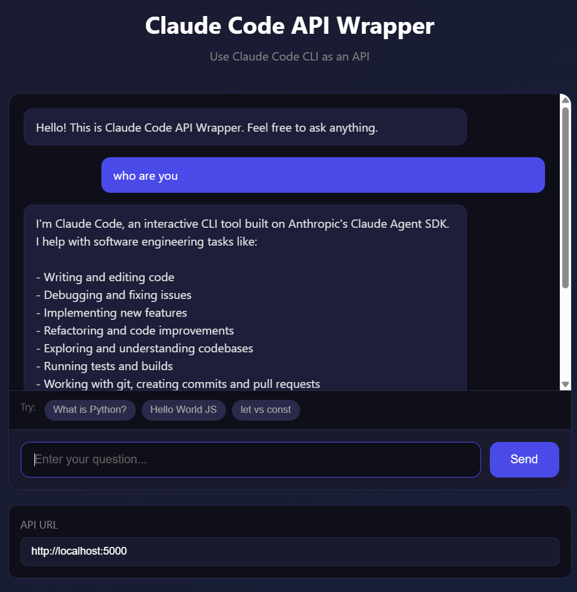

[한국어](README.md) | **English**

# Claude Code API Wrapper



A project that wraps Claude Code CLI as a REST API.

Use Claude Code with your Claude Pro/Max subscription and call it as an API without additional API charges.

## Prerequisites

- Python 3.10+
- [Claude Code CLI](https://docs.anthropic.com/en/docs/claude-code) installed and authenticated
- Claude Pro or Max subscription

## Installation

```bash
# Clone repository
git clone https://github.com/your-username/claude-code-api-wrapper.git
cd claude-code-api-wrapper

# Create and activate virtual environment
python -m venv .venv
source .venv/bin/activate  # Windows: .venv\Scripts\activate

# Install dependencies
pip install fastapi uvicorn python-dotenv requests
```

## Configuration

```bash
# Create environment file
cp .env.example .env
```

Edit `.env` file:
```
PORT=5000
HOST=0.0.0.0
```

## Run

```bash
python main.py
```

Once the server starts:
- API Documentation: http://localhost:5000/docs
- Web UI: http://localhost:5000

## API Usage

### Endpoints

| Method | Path | Description |
|--------|------|-------------|
| POST | `/ask` | Ask Claude |
| GET | `/health` | Health check |
| GET | `/` | Web UI |

### POST /ask

**Request:**
```json
{
  "prompt": "Hello, Claude!",
  "working_directory": null
}
```

**Response:**
```json
{
  "success": true,
  "response": "Hello! How can I help you today?",
  "error": null
}
```

### cURL Example

```bash
curl -X POST "http://localhost:5000/ask" \
  -H "Content-Type: application/json" \
  -d '{"prompt": "Say hello in Korean"}'
```

## Client Examples

### Python CLI

```bash
cd examples

# Single question
python cli_example.py "What is Python?"

# Interactive mode
python cli_example.py -i
```

### Web UI

Open http://localhost:5000 in your browser

## Project Structure

```
claude-code-api-wrapper/
├── main.py              # FastAPI server
├── .env.example         # Environment variables example
├── .gitignore
├── README.md
└── examples/
    ├── cli_example.py   # CLI client example
    └── index.html       # Web UI
```

## Notes

- Claude Code CLI must be installed and authenticated.
- This wrapper follows the usage limits of your Claude Pro/Max subscription.
- Add proper authentication/authorization for production use.

## License

MIT License
