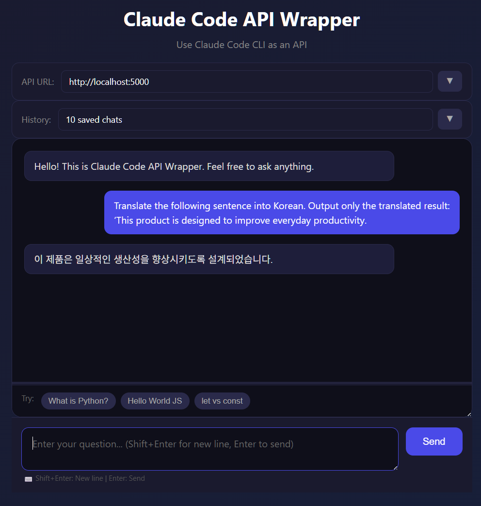
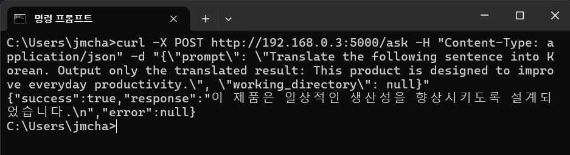

**한국어** | [English](README.en.md)

# Claude Code API Wrapper

Claude Code CLI를 REST API로 래핑하여 사용할 수 있게 해주는 프로젝트입니다.

Claude Pro/Max 구독으로 Claude Code를 사용하면서, 별도의 API 결제 없이 API 형태로 호출할 수 있습니다.

## 사전 요구사항

- Python 3.10+
- [Claude Code CLI](https://docs.anthropic.com/en/docs/claude-code) 설치 및 인증 완료
- Claude Pro 또는 Max 구독

## 설치

```bash
# 저장소 클론
git clone https://github.com/your-username/claude-code-api-wrapper.git
cd claude-code-api-wrapper

# 가상환경 생성 및 활성화
python -m venv .venv
source .venv/bin/activate  # Windows: .venv\Scripts\activate

# 의존성 설치
pip install fastapi uvicorn python-dotenv requests
```

## 설정

```bash
# 환경변수 파일 생성
cp .env.example .env
```

`.env` 파일 편집:
```
PORT=5000
HOST=0.0.0.0
```

## 실행

```bash
python main.py
```

서버가 시작되면:
- API 문서: http://localhost:5000/docs
- 웹 UI: http://localhost:5000

## 웹 UI 기능



### 주요 기능

- **여러 줄 입력**: Shift+Enter로 줄바꿈, Enter로 전송
- **API URL 관리**: 헤더의 드롭다운에서 여러 개의 API URL 저장 및 전환
- **채팅 이력**: 모든 대화가 자동으로 저장되며, 최대 20개까지 보관
  - 저장된 채팅 클릭하여 복원 가능
  - 개별 또는 전체 삭제 가능
- **채팅창 크기 조절**: 메시지 영역과 예시 사이의 바를 드래그하여 크기 조절
- **모바일 반응형**: 모바일/태블릿에서도 완벽히 작동
- **자동 저장**: 입력한 메시지들이 자동으로 브라우저 저장소에 저장됨

## API 사용법

### 엔드포인트

| 메서드 | 경로 | 설명 |
|--------|------|------|
| POST | `/ask` | Claude에 질문 |
| GET | `/health` | 서버 상태 확인 |
| GET | `/` | 웹 UI |

### POST /ask

**요청:**
```json
{
  "prompt": "Hello, Claude!",
  "working_directory": null
}
```

**응답:**
```json
{
  "success": true,
  "response": "Hello! How can I help you today?",
  "error": null
}
```

### 작업 디렉토리 지정

특정 폴더의 컨텍스트에서 질문하려면:

```json
{
  "prompt": "이 폴더의 파일들을 분석해줘",
  "working_directory": "F:\\my_project"
}
```

### cURL 예시

```bash
curl -X POST "http://localhost:5000/ask" \
  -H "Content-Type: application/json" \
  -d '{"prompt": "Say hello in Korean"}'
```

## 클라이언트 예시

### Python CLI



```bash
cd examples

# 단일 질문
python cli_example.py "What is Python?"

# 대화형 모드
python cli_example.py -i
```

### 웹 UI

브라우저에서 http://localhost:5000 접속

## 프로젝트 구조

```
claude-code-api-wrapper/
├── main.py              # FastAPI 서버
├── .env.example         # 환경변수 예시
├── .gitignore
├── README.md
└── examples/
    ├── cli_example.py   # CLI 클라이언트 예시
    └── index.html       # 웹 UI
```

## 주의사항

- Claude Code CLI가 설치되어 있고 인증이 완료되어 있어야 합니다.
- 이 래퍼는 Claude Pro/Max 구독의 사용량 제한을 따릅니다.
- 프로덕션 환경에서 사용 시 적절한 인증/인가를 추가하세요.

## 라이선스

MIT License
